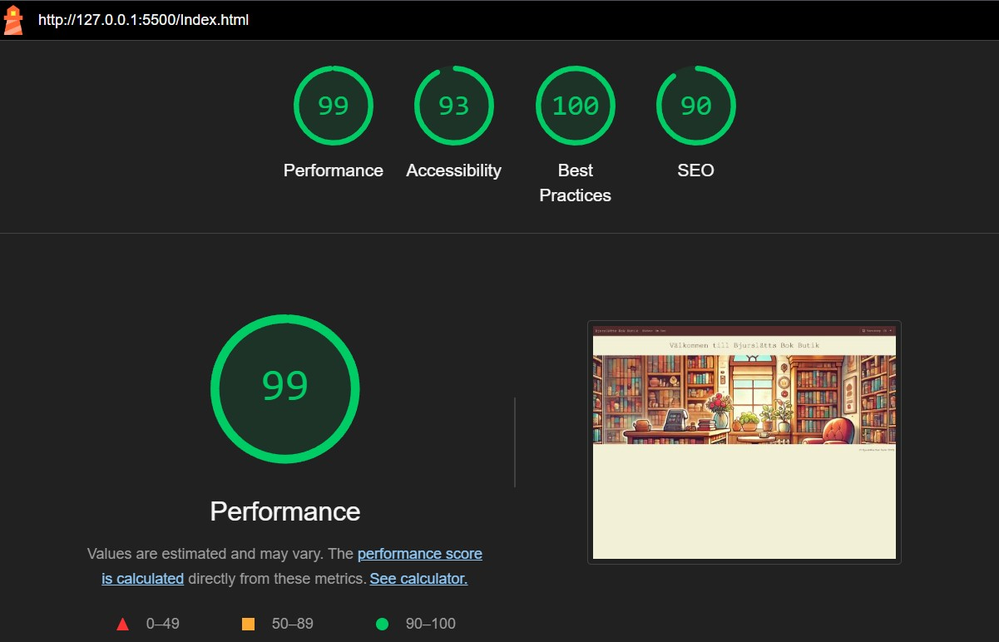
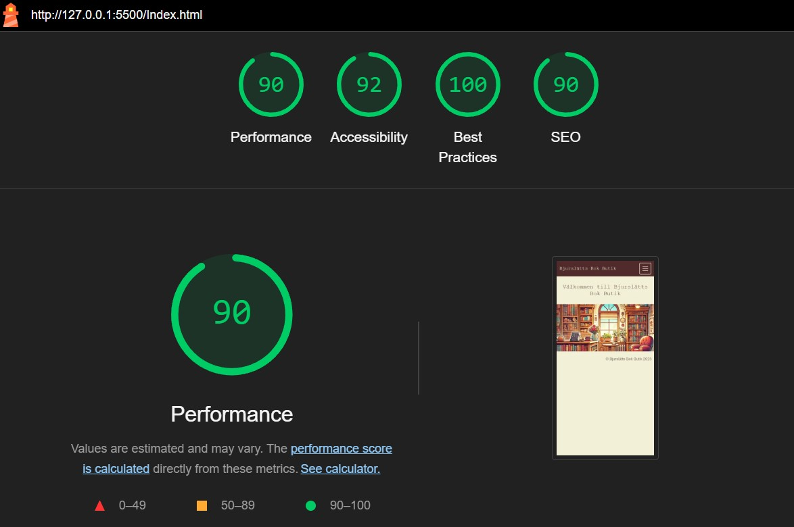
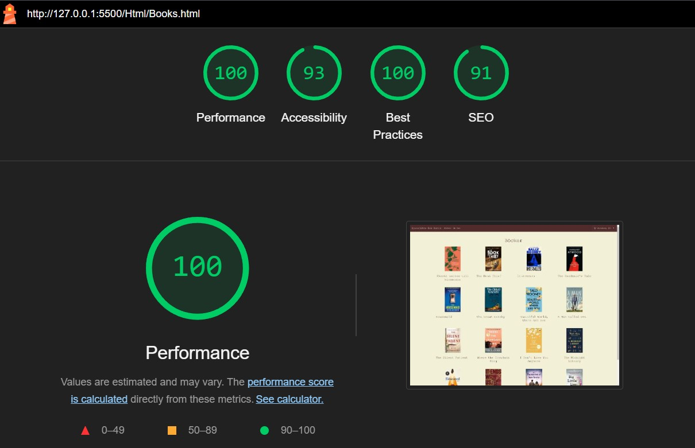
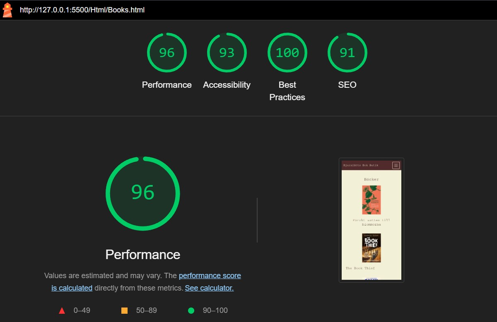
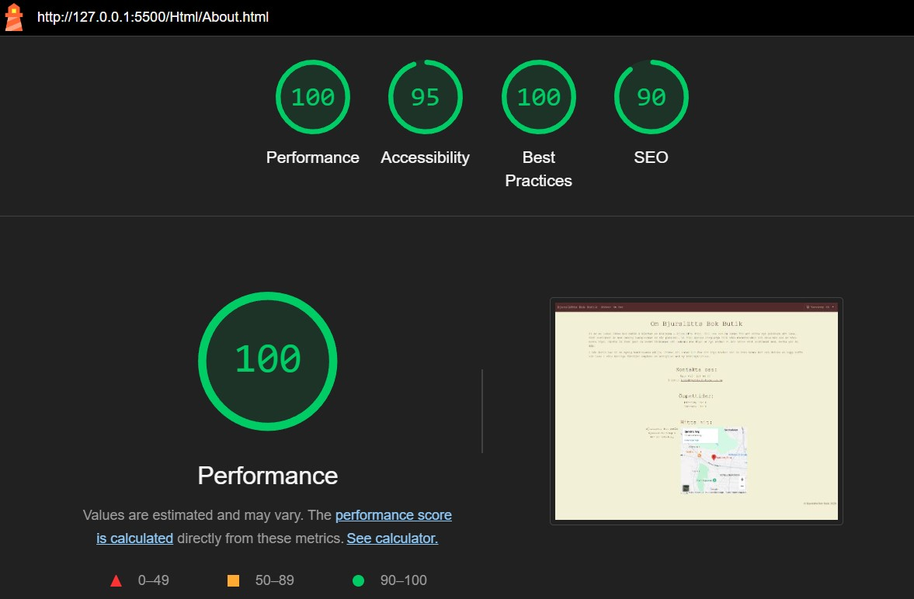
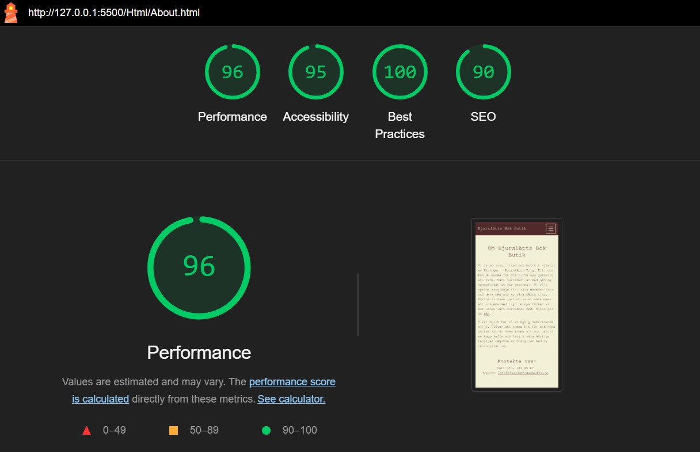

# BookStore Web Application

Detta är min första inlämning i kursen Webbprogrammering med .NET. Uppgiftens syfte är att utifrån ett fiktivt case skapa en prototyp av en hemsida för ett lokalt företag. 

## Projektbeskrivning och funktioner

Jag har valt att göra en hemsida för en lokal (påhittad) bokhandel. På hemsidan kan man:
* **Bokvisning och detaljer**: Användaren kan se en vy med böcker och klicka på en bok för att få detaljerad information
* **Varukorg**: Möjlighet att lägga till böcker i en varukorg för framtida köp
* **Bokförslag**: Användaren kan föreslå böcker som butiken kan lägga till i sitt sortiment
* **Kontakt med butiken**: Användaren kan via en länk smidigt skicka e-post till butiken. Via Google Maps integration kan man tydligt se butikens fysiska plats på en karta.

## Teknologier och prestanda

* **HTML**: Struktur för webbsidan
* **CSS och Bootstrap**: Design och layout
* **JavaScript**: Funktionalitet för bland annat att hämta bokdata och hantera varukorgen
* **OpenLibraryAPI**: Används för att hämta bokinformation baserat på ISBN. Hämtade bilder converteras med JavaSript till WebP format för att förbättra prestandan i Lighthouse.

## Lighthouse

För att uppnå VG på uppgiften krävedes över 90 % på samtliga sidor i både mobile- och desktop läge på Lighthouse. Nedan följer skärmbilder för Lighthouse resultaten:

Lighthouse resultat för index.html i desktop mode samt mobile mode:  
 
  
Lighthouse resultat för Books.html i desktop mode samt mobile mode:  
 
  
Lighthouse resultat för About.html i desktop mode samt mobile mode:  
 

